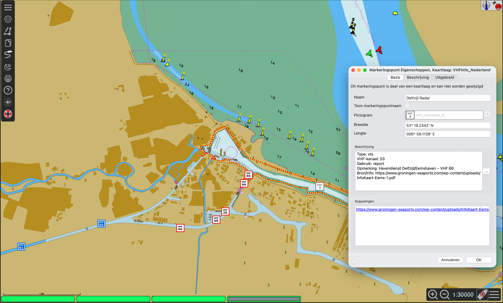

# VHF2OpenCPN

VHF2OpenCPN maakt VHF-gerelateerde informatie voor Nederland beschikbaar als permanente lagen in OpenCPN.

Op digitale waterkaarten is marifooninformatie niet altijd direct of volledig zichtbaar. Vooral de grenzen van VHF-/VTS-gebieden en de overgang van het ene naar het andere blokkanaal kunnen tijdens het varen lastig snel te vinden zijn. In de praktijk moet daarvoor soms informatie uit meerdere bronnen worden geraadpleegd. VHF2OpenCPN brengt deze informatie rechtstreeks in OpenCPN, zodat relevante VHF-informatie op de kaart beschikbaar is op het moment dat die nodig is.

De achtergrond van dit idee en de behoefte aan beter zichtbare VHF-informatie wordt onder andere besproken in dit topic op Zeilersforum:

- https://zeilersforum.nl/index.php/forum-125/elektronische-navigatie/599863-vhf-info-op-een-handigere-manier

Het project bevat momenteel twee kaartlagen:

- **VHFinfo Nederland** – VHF-gebieden en locaties uit de Nederlandse VHFinfo-dataset.
- **Rijkswaterstaat marifoonborden** – relevante scheepvaartverkeerstekens voor marifoongebruik, waaronder B.11.a, B.11.b en E.23.

De lagen kunnen rechtstreeks vanuit OpenCPN worden geïnstalleerd en bijgewerkt via de **Kaartdownloader**.

## Installeren via de Kaartdownloader

### 1. Controleer of de Kaartdownloader actief is

Open in OpenCPN **Opties** en ga naar **Plugins**.

Controleer of **Chart Downloader / Kaartdownloader** is ingeschakeld. Als de plugin nog niet actief is, schakel hem in en sluit daarna het venster met **OK**.

### 2. Voeg VHF2OpenCPN als kaartbron toe

Ga naar:

**Opties → Kaarten → Kaartdownloader**

Kies **Catalogus toevoegen / Add Catalog**. Afhankelijk van de gebruikte OpenCPN-versie kan daarna ook de keuze **Custom / Aangepast** worden getoond.

Gebruik bijvoorbeeld als naam:

```text
VHF2OpenCPN
```

Gebruik als catalogus-URL:

```text
https://raw.githubusercontent.com/kwillems/VHF2OpenCPN/main/catalog/VHF2OpenCPN.xml
```

Kies als download-/installatiemap de OpenCPN-basislocatie die ook voor vergelijkbare permanente OpenCPN-lagen wordt gebruikt. De VHF2OpenCPN-pakketten zijn zo opgebouwd dat de bestanden bij het uitpakken automatisch in de juiste `opencpn/layers`- en `opencpn/UserIcons`-mappen terechtkomen.

Bevestig daarna het toevoegen van de catalogus.

### 3. Werk de catalogus bij

Selecteer **VHF2OpenCPN** in de Kaartdownloader en kies **Bijwerken / Update**.

Na het ophalen van de catalogus verschijnen drie onderdelen:

1. **VHFinfo Nederland**
2. **Rijkswaterstaat marifoonborden**
3. **UserIcons voor VHF2OpenCPN**

### 4. Download de drie onderdelen

Selecteer en download:

**1. VHFinfo Nederland**  
Installeert de permanente OpenCPN-laag met de gegevens uit VHFinfo.

**2. Rijkswaterstaat marifoonborden**  
Installeert de permanente OpenCPN-laag met de relevante RWS-marifoonborden.

**3. UserIcons voor VHF2OpenCPN — verplicht**  
Dit pakket bevat de symbolen die door beide lagen worden gebruikt. Installeer dit pakket altijd. Zonder de UserIcons kan OpenCPN de bedoelde VHF-symbolen niet tonen.

Voor normaal gebruik wordt daarom aangeraden **alle drie de onderdelen te selecteren en te downloaden**.

### 5. Herstart OpenCPN

Herstart OpenCPN nadat de downloads zijn geïnstalleerd. Dit is met name van belang zodat de nieuwe UserIcons worden ingelezen.

De twee kaartlagen horen daarna als permanente lagen beschikbaar te zijn in OpenCPN. Via **Route- en markeringsbeheer → Lagen** kunnen ze zichtbaar of onzichtbaar worden gemaakt.

### Bijwerken

Nieuwe versies van de gegevens kunnen via dezelfde Kaartdownloader worden opgehaald.

Open opnieuw:

**Opties → Kaarten → Kaartdownloader**

Selecteer **VHF2OpenCPN**, werk de catalogus bij en download de onderdelen waarvoor een nieuwere versie beschikbaar is. Wanneer het UserIcons-pakket is gewijzigd, is het verstandig OpenCPN daarna opnieuw te starten.

## Zelf de kaartlagen bouwen

De bestanden in deze repository kunnen ook lokaal opnieuw uit de oorspronkelijke gegevensbronnen worden opgebouwd. Hiervoor is alleen **Python 3** nodig; er zijn geen externe Python-modules vereist.

### VHFinfo Nederland

`update_vhfinfo.py` downloadt de Nederlandse VHFinfo-dataset en zet deze om naar een OpenCPN-compatibel GPX-bestand.

Bronnen:

- https://github.com/htool/vhfinfo
- https://raw.githubusercontent.com/htool/vhfinfo/main/data/NLD.json

### Rijkswaterstaat marifoonborden

`update_rws_vhf.py` haalt scheepvaartverkeerstekens op via de WFS-service van Rijkswaterstaat. Het script selecteert de voor dit project relevante marifoonborden, waaronder B.11.a, B.11.b en E.23, en voert aanvullende controles op de gegevens uit.

Bronservice:

- https://geo.rijkswaterstaat.nl/services/ogc/gdr/geografische_areaalregistratie/ows

### Kaartlagen genereren

Voer vanuit de hoofdmap van de repository uit:

```bash
python3 scripts/update_vhfinfo.py
python3 scripts/update_rws_vhf.py
```

De scripts schrijven standaard naar:

```text
layers/VHFinfo_Nederland.gpx
layers/RWS_Marifoonborden.gpx
```

De scripts bepalen de projectmap aan de hand van hun eigen locatie en zijn daarom niet afhankelijk van de naam van de lokale repositorymap.

### Downloadpakketten en catalogus bouwen

Nadat een of beide GPX-bestanden zijn bijgewerkt:

```bash
python3 scripts/build_distribution.py
```

Dit maakt opnieuw:

```text
packages/VHFinfo_Nederland.zip
packages/RWS_Marifoonborden.zip
packages/VHF2OpenCPN_UserIcons.zip
catalog/VHF2OpenCPN.xml
```

Een volledige lokale rebuild kan dus zo worden uitgevoerd:

```bash
python3 scripts/update_vhfinfo.py
python3 scripts/update_rws_vhf.py
python3 scripts/build_distribution.py
```

## Projectstructuur

```text
VHF2OpenCPN/
├── README.md
├── .gitignore
├── scripts/
│   ├── update_vhfinfo.py
│   ├── update_rws_vhf.py
│   └── build_distribution.py
├── layers/
│   ├── VHFinfo_Nederland.gpx
│   └── RWS_Marifoonborden.gpx
├── UserIcons/
│   └── ...
├── packages/
│   ├── VHFinfo_Nederland.zip
│   ├── RWS_Marifoonborden.zip
│   └── VHF2OpenCPN_UserIcons.zip
└── catalog/
    └── VHF2OpenCPN.xml
```

## Opbouw van de OpenCPN-pakketten

De downloadpakketten gebruiken dezelfde basisopzet als andere permanente OpenCPN-lagen. De interne paden beginnen met `opencpn/`, zodat de Kaartdownloader de bestanden relatief ten opzichte van de gekozen installatiebasis kan uitpakken.

Voorbeelden:

```text
VHFinfo_Nederland.zip
└── opencpn/
    └── layers/
        └── VHFinfo_Nederland.gpx
```

```text
RWS_Marifoonborden.zip
└── opencpn/
    └── layers/
        └── RWS_Marifoonborden.gpx
```

```text
VHF2OpenCPN_UserIcons.zip
└── opencpn/
    └── UserIcons/
        └── ...
```

De XML-catalogus gebruikt voor ieder pakket `target_filename`, zodat de OpenCPN Kaartdownloader het downloadpakket correct verwerkt.

## Disclaimer

VHF2OpenCPN is een onafhankelijk project en is niet verbonden aan of uitgegeven door VHFinfo, Rijkswaterstaat of OpenCPN.

De gegevens zijn bedoeld als aanvullende nautische informatie. Controleer voor de navigatie en het marifoongebruik altijd de actuele officiële nautische publicaties, lokale voorschriften en verkeersinformatie. VHF2OpenCPN vervangt deze bronnen niet.
